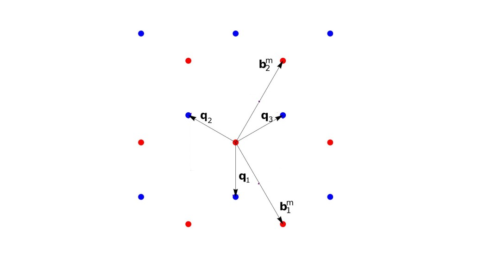
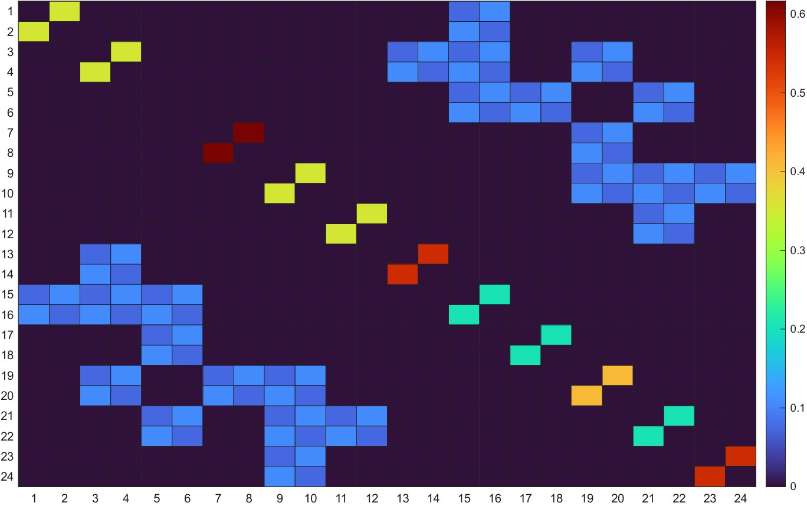

This tutorial documents the continuum models used by the group for twisted bilayer graphene (TBG) and twisted transition metal dichalcogenides (TMD) moiré systems, including theory, code, and worked examples.

---

## Section 1 — Twisted Bilayer Graphene (TBG) Continuum Model

### Introduction

At the "magic angle" (~1.1°), twisted bilayer graphene hosts nearly flat moiré bands that give rise to correlated insulating states, superconductivity, and orbital magnetism. The continuum (Bistritzer-MacDonald) model captures the low-energy electronic structure without requiring a full DFT calculation of the enormous moiré unit cell (up to ~10,000 atoms). This section documents the group's implementation and how to use it. First, there is a summary of the theory followed by a more in-depth guide.

### Summary

The TBG continuum model (Bistritzer & MacDonald, 2011) treats each graphene layer as a Dirac cone shifted in momentum space by the twist. The Hamiltonian near a valley $K$ is:

$$
H_K = \begin{pmatrix}
h_+(\mathbf{k}) & T(\mathbf{r}) \\
T^\dagger(\mathbf{r}) & h_-(\mathbf{k})
\end{pmatrix}
$$

where $h_\pm(\mathbf{k}) = \hbar v_F \boldsymbol{\sigma}_{\pm\theta/2} \cdot \mathbf{k}$ are the Dirac Hamiltonians of the top/bottom layers rotated by $\pm\theta/2$, and:

$$
T(\mathbf{r}) = \sum_{j=1}^{3} T_j \, e^{i \mathbf{q}_j \cdot \mathbf{r}}
$$

is the interlayer tunneling with moiré wavevectors $\mathbf{q}_j$ connecting the Dirac cones. The tunneling matrices are:

$$
T_1 = \omega_0 \begin{pmatrix} 1 & 1 \\ 1 & 1 \end{pmatrix}, \quad
T_2 = \omega_0 \begin{pmatrix} 1 & \phi^{-1} \\ \phi & 1 \end{pmatrix}, \quad
T_3 = \omega_0 \begin{pmatrix} 1 & \phi \\ \phi^{-1} & 1 \end{pmatrix}
$$

where $\phi = e^{2\pi i/3}$ and $\omega_0 \approx 110$ meV is the tunneling amplitude

### Geometry

Single layer graphene features a honeycomb structure defined by two superimposed and offset triangular sublattices, often labeled A and B. We will begin with the real-space basis given by:

$$
\begin{aligned}
\mathbf{a}_1 &= a \left( \frac{1}{2}, \frac{\sqrt{3}}{2} \right) \\
\mathbf{a}_2 &= a \left( -\frac{1}{2}, \frac{\sqrt{3}}{2} \right)
\end{aligned}
$$

where $a$ is the lattice constant. The sublattices, often denoted A and B, share the same basis vectors, but are offset by a single basis vector 30° clockwise and scaled by $\frac{1}{\sqrt3}$. These two sublattices make up the single layer graphene real space lattice.

Now, we duplicate this lattice for layer 2, and rotate the former by $\frac{\theta}{2}$ and the latter by $-\frac{\theta}{2}$. For small twist angles, we can look at reciprocal space and define

$$
\begin{aligned}
\mathbf{b}^m_1 &= \mathbf{b}_{1,1} - \mathbf{b}_{2,1} \\
\mathbf{b}^m_2 &= \mathbf{b}_{1,2} - \mathbf{b}_{2,2}
\end{aligned}
$$

These are the moiré basis vectors. In our low-energy expansion, we will zoom in on this moiré scale, and these K/K' points will form the basis for our Hamiltonian.  


### The Generalized Umklapp Derivation

In this section, we aim to motivate our choice of the moiré basis, as well as to specify how to populate our final Hamiltonian. We will prove that hopping events can only occur between two $K$ points that are separated by a **moiré** reciprocal lattice vector. This derivation follows entirely from Catarina 2019 [eq. 59-71].

We begin the derivation of the moiré interlayer coupling by expressing the interlayer Hamiltonian in the basis of atomic-like localized states $|l, R_l, \alpha \rangle$ for each layer:
$$
V_{12} = \sum_{R_1, \alpha, R_2, \beta} c_{1,\alpha}^\dagger(R_1) t_{12}^{\alpha\beta}(R_1, R_2) c_{2,\beta}(R_2)
$$

where $t_{12}^{\alpha\beta}(R_1, R_2) = \langle 1, R_1, \alpha | H_{\perp} | 2, R_2, \beta \rangle$ represents the interlayer hopping in the tight-binding basis. In the spirit of a **two-center approximation**, we assume the hopping $t_{12}^{\alpha\beta}(R_1, R_2)$ depends only on the relative separation between the centers of the two orbitals:

$$
t_{12}^{\alpha\beta}(R_1, R_2) = t_{12}^{\alpha\beta}(R_1 + \tau_{1,\alpha} - R_2 - \tau_{2,\beta})
$$

This hopping potential can be expressed via a 2D Fourier transform $t_{12}^{\alpha\beta}(p)$:

$$
t_{12}^{\alpha\beta}(R_1 + \tau_{1,\alpha} - R_2 - \tau_{2,\beta}) = \int_{\mathbb{R}^2} \frac{d^2p}{(2\pi)^2} e^{ip \cdot (R_1 + \tau_{1,\alpha} - R_2 - \tau_{2,\beta})} t_{12}^{\alpha\beta}(p)
$$

To transform this into momentum space, we write the operators in terms of Bloch waves for the individual layers:

$$
c_{l,\alpha}^\dagger(R_l) = \frac{1}{\sqrt{N_l}} \sum_{k_l} e^{-ik_l \cdot (R_l + \tau_{l,\alpha})} c_{l,\alpha}^\dagger(k_l)
$$

Substituting these expressions into the interlayer matrix element $T_{12}^{\alpha\beta}(k_1, k_2)$, we obtain:

$$
T_{12}^{\alpha\beta}(k_1, k_2) = \frac{1}{\sqrt{N_1 N_2}} \int_{\mathbb{R}^2} \frac{d^2p}{(2\pi)^2} \sum_{R_1} e^{-i(k_1 - p) \cdot (R_1 + \tau_{1,\alpha})} t_{12}^{\alpha\beta}(p) \sum_{R_2} e^{i(k_2 - p) \cdot (R_2 + \tau_{2,\beta})}
$$

By applying the lattice sum rule $\sum_{R_l} e^{ik \cdot R_l} = N_l \sum_{G_l} \delta_{k, G_l}$ and evaluating the integral over $p$, the expression simplifies to:

$$
T_{12}^{\alpha\beta}(k_1, k_2) = \frac{1}{\sqrt{A_{u.c.1} A_{u.c.2}}} \sum_{G_1, G_2} e^{-iG_1 \cdot \tau_{1,\alpha}} t_{12}^{\alpha\beta}(k_1 + G_1) e^{-iG_2 \cdot \tau_{2,\beta}} \delta_{k_1 + G_1, k_2 + G_2}
$$

where $A_{u.c.l}$ is the area of the unit cell of layer $l$. The presence of the Kronecker delta implies that two states of layer 1 and 2 with respective crystal-momentum $k_1$ and $k_2$ are only coupled if reciprocal lattice vectors $G_1$ and $G_2$ of each layer exist such that:

$$
k_1 + G_1 = k_2 + G_2
$$

This condition is fundamentally known as the **generalized umklapp condition**. Notice this can also be written as the following:

$$
k_1 - k_2 = b_{n}^{m}
$$

### Intralayer Hamiltonian

The intralayer Hamiltonians can be written in compact form as:

$$
H_{l}^{\pm K}(\mathbf{q}) = v_F \hbar \mathbf{q} \cdot (\pm \sigma_x^{\theta_l}, \sigma_y^{\theta_l})
$$

with $\theta_l$ given by $\pm\frac{\theta}{2}$ and the rotated Pauli matrices defined as:

$$
\begin{aligned}
\sigma_x^{\theta_l} &= \sigma_x \cos \theta_l - \sigma_y \sin \theta_l \\
\sigma_y^{\theta_l} &= \sigma_x \sin \theta_l + \sigma_y \cos \theta_l
\end{aligned}
$$

$q$ is the "center" of the Hamiltonian, or which momentum in reciprocal space the Hamiltonian is being evaluated at.

### Interlayer Hamiltonian

Hopping can occur between adjacent sites of opposite layers. The interlayer hopping matrices are:

$$
T_1 = \omega_0 \begin{pmatrix} 1 & 1 \\ 1 & 1 \end{pmatrix}, \quad
T_2 = \omega_0 \begin{pmatrix} 1 & \phi^{-1} \\ \phi & 1 \end{pmatrix}, \quad
T_3 = \omega_0 \begin{pmatrix} 1 & \phi \\ \phi^{-1} & 1 \end{pmatrix}
$$

where $\phi = e^{2\pi i/3}$ and $\omega_0 \approx 110$ meV is the hopping amplitude. **To include atomic relaxations, set:**

$$ 
\omega_0 = 
\begin
{pmatrix}\omega_{AA} & \omega_{AB} \\
\omega_{AB} & \omega_{AA}
\end{pmatrix}
$$

$T_n$ correspond to moiré lattice sites separated by $q_n$. There are 3 possible directions for hopping, each separated by 120° or $\frac{2\pi}{3}$, hence the 3 unique matrices. They are pictorally shown below.

{fig-width=8}

### Populating the Hamiltonian

Each dirac cone is described by a 2x2 matrix. Thus our full Hamiltonian will be a 2N x 2N matrix with each 2x2 in our basis corresponding to one K/K' point, or moiré lattice site. The basis of moiré sites should be determined by a cutoff radius in k space. 

For now, consider for a second each moiré lattice site to be an ordinary 1x1 matrix element. Diagonal terms for the Hamiltonian will consist of intralayer Hamiltonians. Off-diagonal terms will consist of interlayer Hamiltonians, or between moiré sites. If the corresponding moiré lattice sites are not coupled the interlayer term will be zero. Returning back to the 2x2 representation, here is a sample image of proper Hamiltonian filling. 



Some quick visual checks:

* Hermiticity (Symmetric in absolute value, check with "ishermitian" in MATLAB)
* Maximum 3 other moiré sites coupled to any single one
* Off-diagonal terms should sit on one half of the matrix if the basis is ordered by layer. Layer 1 points cannot couple to other layer 1 points.
* Same number of basis sites in layers 1 and 2

Interlayer population must realize which basis points are coupled and populate the off-diagonal with one of the 3 hopping matrices that corresponds to the correct direction of separation.

### Usage

1. Set the twist angle $\theta$ and the tunneling parameters $\omega_{AA}$, $\omega_{AB}$.
2. Build the Hamiltonian in momentum space by expanding in the moiré reciprocal lattice.
3. Diagonalize at each $\mathbf{k}$-point in the moiré Brillouin zone (mBZ).
4. Plot band structure, DOS, Berry curvature, or Chern numbers.

**Key parameters:**

| Parameter | Typical value | Description |
|---|---|---|
| $a$ | 2.46 $\mathring{A}$ | Lattice constant of graphene |
| $\theta$ | 1.05° (magic) | Twist angle |
| $v_F$ | $10^6$ m/s | Dirac velocity of graphene |
| $w_{AA}$ | 0–80 meV | AA site tunneling considering relaxation |
| $w_{AB}$ | 110 meV | AB site tunneling considering relaxation |
| $N_\text{shell}$ | 3–5 | Number of moiré shells in basis |

### Sample Data

The following data and plots used the parameters above with a 6 shell basis


### Bug Reports and Warnings

::: {.callout-warning}
**k-point folding into the mBZ.** Momentum points must be folded into the moiré Brillouin zone before passing to the Hamiltonian. Passing points outside the mBZ does not cause an error but gives incorrect band ordering.
:::

::: {.callout-warning}
**Basis size convergence.** Using `n_shell=1` (9 G-vectors) is insufficient even for the flat bands at the magic angle; use at least `n_shell=3`. For remote bands or Berry curvature calculations, use `n_shell=5`.
:::

::: {.callout-note}
**Valley and spin degeneracy.** The code above computes one valley ($K$). The $K'$ valley is related by time-reversal: $H_{K'}(\mathbf{k}) = H_K^*(-\mathbf{k})$. The total DOS and transport quantities should include both valleys and both spins (factor of 4).
:::

Known issues:

- The q-vector construction in the code assumes the chiral gauge; if you switch to a different gauge the tunneling matrices `T[nu]` must be updated consistently.
- At exactly $\theta = 0$ the code is singular (moiré period diverges); use a minimum of $\theta \approx 0.3°$.

### Additional Resources

- Bistritzer & MacDonald, *PNAS* **108**, 12233 (2011) — original TBG continuum model
- Tarnopolsky, Kruchkov & Vishwanath, *PRL* **122**, 106405 (2019) — chiral TBG model
- [TwistronicsLab code](https://github.com/jabirali/twistronics) — open-source reference implementation
- Song et al., *PRL* **123**, 036401 (2019) — fragile topology of TBG flat bands

---

## Section 2 — TMD Moiré Continuum Model

### Introduction

Twisted TMD homobilayers (e.g., MoSe₂/MoSe₂, WSe₂/WSe₂) and heterobilayers (MoSe₂/WSe₂) host moiré flat bands in the valence band at twist angles of 1°–5°. These systems are distinct from TBG because the low-energy carriers live at the $K/K'$ points of a **massive Dirac** (rather than massless Dirac) spectrum, and strong spin-orbit coupling locks spin to the valley. This section documents the group's continuum model for TMD moirés.

### Physics

The low-energy valence band near valley $K$ of a monolayer TMD is described by a massive Dirac Hamiltonian:

$$
h_\tau(\mathbf{k}) = \begin{pmatrix}
\frac{\Delta}{2} & \hbar v_F (\tau k_x - i k_y) \\
\hbar v_F (\tau k_x + i k_y) & -\frac{\Delta}{2}
\end{pmatrix} + \tau \frac{\lambda}{2} \sigma_z
$$

where $\tau = \pm 1$ is the valley index, $\Delta$ is the band gap, $\lambda$ is the SOC splitting, and the valence band maximum is at $K$.

In a twisted TMD bilayer, the moiré potential from the registry variation modulates the on-site energy. Unlike TBG, the tunneling between the two layers is **suppressed** (due to the large momentum mismatch and the massive gap), and the dominant moiré effect is an **intralayer** moiré potential:

$$
H_\text{moiré}(\mathbf{r}) = V_0 \sum_{j=1}^{6} e^{i \mathbf{G}_j \cdot \mathbf{r}} + \text{h.c.}
$$

where $\mathbf{G}_j$ are the moiré reciprocal lattice vectors and $V_0$ is the moiré potential amplitude. The effective single-band model for the top-of-valence-band hole (spin-up, valley $K$) is:

$$
H = -\frac{\hbar^2 \nabla^2}{2 m^*} + V_0 \sum_{j=1}^{6} \cos(\mathbf{G}_j \cdot \mathbf{r} + \phi_j)
$$

where $m^*$ is the effective mass and $\phi_j$ encodes the local stacking geometry (MM, MX, XX high-symmetry points).

For a heterobilayer, the interlayer tunneling $t_\perp$ is finite and must be included; it hybridizes the two layers and opens a gap at the moiré Brillouin zone boundary.

### Usage

1. Set the twist angle $\theta$ and material parameters ($m^*$, $V_0$, $\phi$, $t_\perp$).
2. Build the plane-wave basis for the moiré superlattice.
3. Diagonalize to get the moiré valence bands.
4. Calculate DOS, effective mass, and Chern number of the flat bands.

**Key parameters for MoSe₂/MoSe₂ (from literature):**

| Parameter | Value | Description |
|---|---|---|
| $m^*$ | $0.62 \, m_e$ | Hole effective mass |
| $V_0$ | 8–15 meV | Moiré potential amplitude |
| $\phi$ | $-89°$ (MoSe₂) | Moiré potential phase |
| $a_0$ | 3.32 Å | MoSe₂ lattice constant |
| $\theta$ | 1°–5° | Twist angle range of interest |

### Code

**TMD moiré continuum model — single-band approximation:**

```python
import numpy as np
from scipy.linalg import eigh

# ── Material parameters (MoSe2/MoSe2) ─────────────────────────────────────────
hbar2_over_2m = 3.81      # eV·Å²  (ℏ²/2m_e)
m_star = 0.62             # in units of m_e
K_eff = hbar2_over_2m / m_star  # eV·Å²

a0_TMD = 3.32             # Å, monolayer lattice constant
V0 = 0.010                # eV, moiré potential amplitude
phi = np.deg2rad(-89)     # moiré potential phase (MoSe2)


def tmd_hamiltonian(k_vec, theta_deg, n_shell=4):
    """
    Single-band continuum model for TMD homobilayer moiré.

    Parameters
    ----------
    k_vec     : array_like shape (2,) — crystal momentum in mBZ (Å⁻¹)
    theta_deg : float — twist angle in degrees
    n_shell   : int   — number of moiré reciprocal lattice shells

    Returns
    -------
    H : ndarray, Hermitian Hamiltonian
    """
    theta = np.deg2rad(theta_deg)
    a_m = a0_TMD / (2 * np.sin(theta / 2))  # moiré lattice constant

    # Moiré reciprocal lattice vectors (hexagonal)
    b1 = (4 * np.pi / (np.sqrt(3) * a_m)) * np.array([1, 0])
    b2 = (4 * np.pi / (np.sqrt(3) * a_m)) * np.array([0.5, np.sqrt(3) / 2])

    # Build G-vector basis
    G_list = []
    for m in range(-n_shell, n_shell + 1):
        for n in range(-n_shell, n_shell + 1):
            G_list.append(m * b1 + n * b2)
    N = len(G_list)

    H = np.zeros((N, N), dtype=complex)

    # First-shell moiré reciprocal lattice vectors
    G1 = b1
    G2 = b2
    G3 = b2 - b1
    G_moire = [G1, G2, G3, -G1, -G2, -G3]

    for i, Gi in enumerate(G_list):
        # Kinetic energy (hole: negative sign)
        kG = np.array(k_vec) + Gi
        H[i, i] -= K_eff * np.dot(kG, kG)

        # Moiré potential: connects G to G ± G_moire
        for j, Gj in enumerate(G_list):
            dG = Gi - Gj
            for nu, Gm in enumerate(G_moire):
                if np.linalg.norm(dG - Gm) < 1e-6:
                    H[i, j] += V0 * np.exp(1j * phi * (1 if nu < 3 else -1))

    return H


def compute_tmd_bands(theta_deg, k_path, n_shell=4):
    bands = []
    for k in k_path:
        H = tmd_hamiltonian(k, theta_deg, n_shell=n_shell)
        eigvals = eigh(H, eigvals_only=True)
        bands.append(eigvals)
    return np.array(bands)
```

**Chern number via Berry curvature (discretized BZ):**

```python
def berry_curvature_chern(theta_deg, n_k=30, band_idx=0):
    """
    Compute Chern number of a moiré band using the discretized
    plaquette method (Fukui-Hatsugai-Suzuki).
    """
    theta = np.deg2rad(theta_deg)
    a_m = a0_TMD / (2 * np.sin(theta / 2))
    b1 = (4 * np.pi / (np.sqrt(3) * a_m)) * np.array([1, 0])
    b2 = (4 * np.pi / (np.sqrt(3) * a_m)) * np.array([0.5, np.sqrt(3) / 2])

    kx_arr = np.linspace(0, 1, n_k, endpoint=False)
    ky_arr = np.linspace(0, 1, n_k, endpoint=False)

    def get_state(kx_frac, ky_frac):
        k = kx_frac * b1 + ky_frac * b2
        H = tmd_hamiltonian(k, theta_deg)
        _, vecs = eigh(H)
        return vecs[:, band_idx]

    F_total = 0.0
    for i, kx in enumerate(kx_arr):
        for j, ky in enumerate(ky_arr):
            u00 = get_state(kx, ky)
            u10 = get_state(kx_arr[(i+1) % n_k], ky)
            u11 = get_state(kx_arr[(i+1) % n_k], ky_arr[(j+1) % n_k])
            u01 = get_state(kx, ky_arr[(j+1) % n_k])
            link = (np.vdot(u00, u10) * np.vdot(u10, u11) *
                    np.vdot(u11, u01) * np.vdot(u01, u00))
            F_total += np.angle(link)

    return int(np.round(F_total / (2 * np.pi)))
```

### Example

**Band structure of MoSe₂/MoSe₂ at θ = 3°:**

```python
import matplotlib.pyplot as plt

theta = 3.0
a_m = a0_TMD / (2 * np.sin(np.deg2rad(theta / 2)))

# High-symmetry points of the moiré hexagonal BZ
b1 = (4 * np.pi / (np.sqrt(3) * a_m)) * np.array([1, 0])
b2 = (4 * np.pi / (np.sqrt(3) * a_m)) * np.array([0.5, np.sqrt(3) / 2])
Gamma = np.array([0.0, 0.0])
K_m   = (b1 + b2) / 3
M_m   = b1 / 2

kpts = np.concatenate([
    np.linspace(Gamma, K_m, 50, endpoint=False),
    np.linspace(K_m,   M_m, 50, endpoint=False),
    np.linspace(M_m, Gamma, 50, endpoint=True),
])

bands = compute_tmd_bands(theta, kpts, n_shell=4)

fig, ax = plt.subplots(figsize=(5, 5))
for band in bands.T[:6]:      # show 6 lowest hole bands
    ax.plot(band * 1000, color="steelblue", lw=0.9)
ax.set_ylabel("Energy (meV)")
ax.set_xticks([0, 50, 100, 149])
ax.set_xticklabels([r"$\gamma$", r"$\kappa$", r"$\mu$", r"$\gamma$"])
ax.set_title(f"MoSe₂/MoSe₂ moiré bands — θ = {theta}°")
plt.tight_layout()
plt.savefig("tmd_bands.pdf", dpi=200)
```

**Chern number scan:**

```python
angles = [1.5, 2.0, 2.5, 3.0, 4.0]
for theta in angles:
    C = berry_curvature_chern(theta, n_k=20, band_idx=0)
    print(f"θ = {theta}°  →  Chern number C = {C}")
```

### Bug Reports and Warnings

::: {.callout-warning}
**Moiré potential phase $\phi$.** The sign convention for $\phi$ varies between papers. The convention in this code follows Zang et al. (2022). If comparing to Wu et al. (2019), flip the sign of $\phi$.
:::

::: {.callout-warning}
**Heterobilayer vs homobilayer.** For heterobilayers (e.g. MoSe₂/WSe₂), you must include both layers explicitly with different $m^*$ and a finite interlayer tunneling $t_\perp$. The single-band code above is valid only for homobilayers where the two layers are equivalent by symmetry.
:::

::: {.callout-note}
**Chern number convergence.** The Berry curvature calculation requires a fine k-mesh near singular points. Use `n_k ≥ 40` for production Chern number calculations; `n_k=20` is only for quick checks.
:::

::: {.callout-note}
**Valley degeneracy.** The model above is for valley $K$ only. The $K'$ valley contributes an equal and opposite Chern number. The total Hall conductivity from both valleys vanishes in the absence of time-reversal breaking; only one valley contributes under a circularly polarized optical field or in the presence of a magnetic field.
:::

Known issues:

- The plane-wave basis treats the moiré as perfectly periodic; strain and disorder are not included. For disorder calculations, a real-space approach is needed.
- The effective mass approximation breaks down for large twist angles ($\theta > 5°$) where remote bands mix in; use the full two-band massive Dirac model instead.

### Additional Resources

- Wu, MacDonald & Martin, *PRL* **121**, 257001 (2018) — first TMD moiré continuum model
- Zang et al., *PRB* **106**, 115416 (2022) — refined TMD moiré model with SOC
- Shabani et al., *Nature Physics* **17**, 720 (2021) — experimental MoSe₂/WSe₂ flat bands
- Li et al., *Nature* **600**, 641 (2021) — correlated states in TMD moiré
- [MoirePy](https://github.com/twistronics/moirepy) — Python library for moiré continuum models (check for updates)
- Fukui, Hatsugai & Suzuki, *JPSJ* **74**, 1674 (2005) — discretized Chern number algorithm

---

*Maintained by the Continuum Model team. Scripts go in `scripts/continuum/` and figures in `figures/`. Add new parameter tables to the relevant section when new materials are calculated.*
